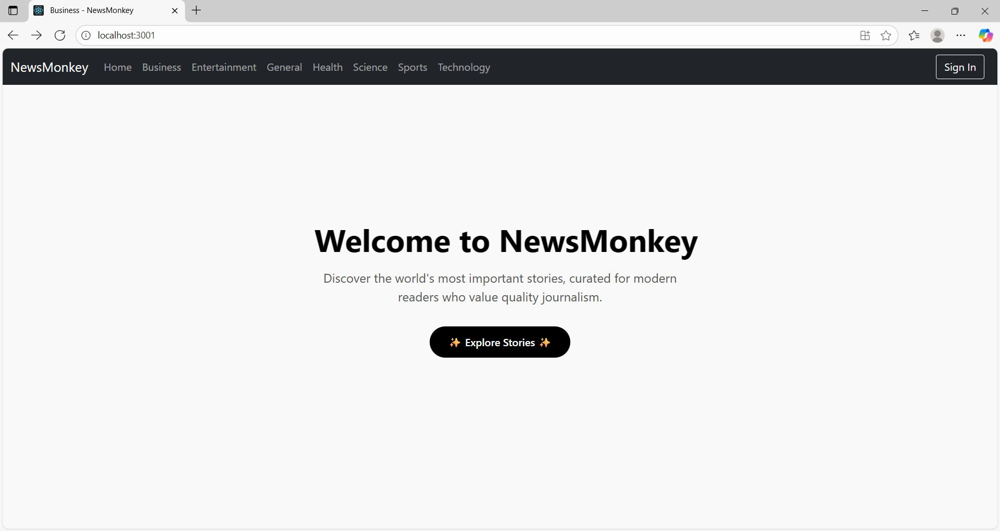
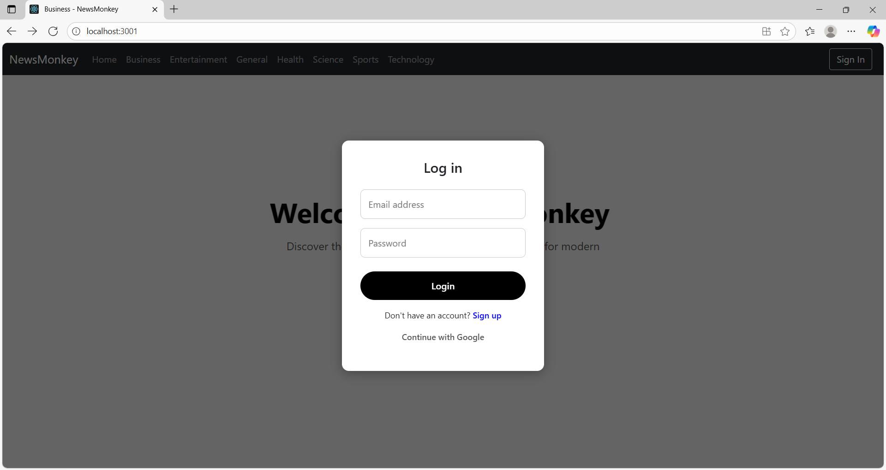

# NewsMonkey 📰

NewsMonkey is a **React.js web application** with **Firebase Authentication** that allows users to browse latest news across multiple categories. Users can **sign up, log in**, and view news in categories like Entertainment, Business, Sports, Technology, and Health.

> ⚠️ **Note:** Currently, the live deployed version is limited due to free API restrictions. The full project runs locally using the News API.

---

## Features
- User Authentication with Firebase (Sign-up / Login)
- Browse news by categories: Entertainment, Business, Sports, Technology, Health
- Responsive UI built with React.js
- Fetches news articles from a news API

---

## Technologies Used
- **Frontend:** React.js, HTML, CSS, JavaScript  
- **Authentication / Backend:** Firebase  
- **API:** NewsAPI.org (local development)  
- **Deployment:** GitHub repository (live site not available due to free API restrictions)

---

## Screenshots

**Homepage:**  

**Business Category:**  

**Login Page:**  

---

## Demo Video (Optional)
- A short video of the app running locally:  
[Watch Demo Video](./demo/newsmonkey-demo.mp4)

---

## Project Link
**GitHub Repository:** [https://github.com/Pranithanjali/newsmonkey.git]

---

## Contact
- **Email:** pranithanjalijogu@gmail.com  
- **LinkedIn:** (https://www.linkedin.com/in/pranithanjali-jogu-8755262b8/)  
